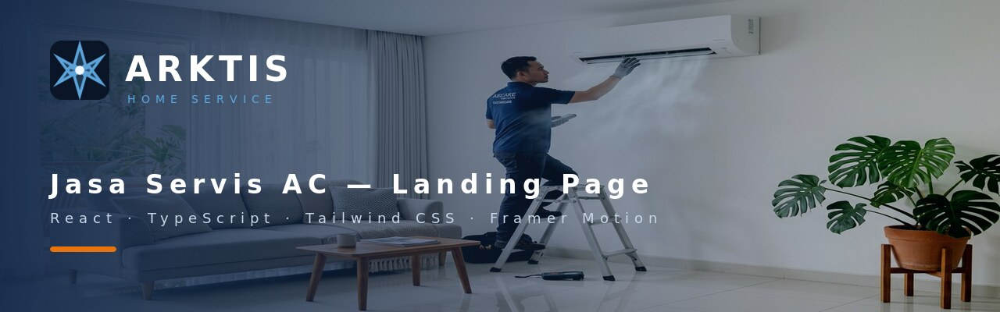

# ARKTIS Home Service — Landing Page Jasa Servis AC

Landing page satu halaman untuk bisnis jasa servis AC *home service* (teknisi datang ke rumah). Dibangun dengan **React + TypeScript + Tailwind CSS**, menekankan kecepatan, tampilan premium, dan alur konversi yang meyakinkan.

> ### ⚠️ Status: Proyek Demo
> Ini adalah **proyek contoh/dummy** untuk menunjukkan hasil kerja, **bukan website bisnis aktif**.
> Seluruh data bisnis — nomor WhatsApp, telepon, email, nama pendiri, testimoni, dan angka statistik — masih berupa contoh. Form booking juga masih simulasi dan belum terhubung ke server mana pun.
>
> Untuk dipakai sungguhan, lihat bagian [Menjadikan Website Aktif](#-menjadikan-website-aktif).

---

## Daftar Isi

- [Tentang Proyek](#-tentang-proyek)
- [Fitur](#-fitur)
- [Teknologi](#-teknologi)
- [Menjalankan Proyek](#-menjalankan-proyek)
- [Konfigurasi Data Bisnis](#-konfigurasi-data-bisnis)
- [Struktur Proyek](#-struktur-proyek)
- [Bagian Halaman](#-bagian-halaman)
- [Menjadikan Website Aktif](#-menjadikan-website-aktif)
- [Dokumentasi](#-dokumentasi)
- [Lisensi](#-lisensi)

---

## Tentang Proyek

Website ini dirancang untuk menjawab tiga kekhawatiran utama pelanggan jasa servis AC:

| Kekhawatiran Pelanggan | Bagaimana Website Menjawabnya |
|---|---|
| "Teknisinya orang beneran bukan? Aman?" | Bagian Jaminan & Kepercayaan, sertifikasi teknisi, profil pendiri |
| "Berapa biayanya? Nanti dibohongin nggak?" | Enam paket layanan dengan harga transparan & rincian pekerjaan |
| "Hasilnya beneran bersih?" | Slider perbandingan Before/After dan galeri proyek |

Alur halaman disusun mengikuti psikologi pembelian: **masalah → solusi → bukti → penawaran → ajakan bertindak**.

---

## Fitur

**Interaksi**
- Slider perbandingan Before/After yang bisa digeser (mouse & sentuh)
- Galeri proyek dengan lightbox — navigasi tombol `Esc`, `←`, `→`
- Akordeon FAQ
- Menu navigasi seluler
- Tombol WhatsApp mengambang yang selalu terlihat

**Presentasi**
- Animasi *scroll reveal* halus dengan Framer Motion
- Statistik beranimasi saat masuk layar
- Efek *ken burns* pada gambar hero
- Sistem desain warna terpusat (tema Arktis: biru malam dengan aksen oranye)

**Teknis**
- TypeScript mode ketat — 0 error
- Responsif dari 320px hingga layar lebar
- Build keluaran berkas tunggal (JS + CSS disisipkan ke HTML)
- Menghormati `prefers-reduced-motion` untuk pengguna yang sensitif terhadap gerakan
- SEO lengkap: Open Graph, Twitter Card, favicon multi-ukuran, URL kanonik

---

## Teknologi

| Kategori | Teknologi | Versi |
|---|---|---|
| Kerangka | React | 19.2 |
| Build tool | Vite | 7.3 |
| Bahasa | TypeScript | 5.9 |
| Styling | Tailwind CSS | 4.1 |
| Animasi | Framer Motion | 13 |
| Ikon | Lucide React | 1.47 |
| QR Code | qrcode.react | terbaru |
| Plugin build | vite-plugin-singlefile | 2.3 |

---

## Menjalankan Proyek

**Prasyarat:** Node.js 18 atau lebih baru.

```bash
# 1. Install dependensi
npm install

# 2. Jalankan server pengembangan
npm run dev
```

Buka `http://localhost:5173` di browser.

**Perintah lain:**

```bash
npm run build     # Build untuk produksi → hasil di folder dist/
npm run preview   # Lihat hasil build secara lokal
```

---

## Konfigurasi Data Bisnis

> **Semua data bisnis terkumpul di satu berkas:** `src/config/site.ts`

Ini dibuat sengaja supaya Anda **tidak perlu menyentuh kode komponen** saat mengganti data. Ubah sekali di berkas itu, seluruh halaman ikut berubah.

```ts
// src/config/site.ts

// Nomor WhatsApp — format internasional, tanpa "+" dan tanpa spasi
export const WHATSAPP_NUMBER = "6281200000001";

// Setel ke false setelah nomor asli dipasang
export const IS_DEMO = true;

export const CONTACT = {
  phone: "+62 812-ARKTIS-1",
  email: "halo@arktisservice.id",
  area: "Jabodetabek · Bandung · Surabaya · Semarang",
  // ...
};
```

| Yang bisa diubah | Berlaku di |
|---|---|
| `WHATSAPP_NUMBER` | 4 tombol WhatsApp + QR code di footer |
| `CONTACT` | Nomor telepon, email, jam operasional, area layanan |
| `SOCIALS` | Ikon Instagram, TikTok, YouTube |
| `SERVICE_LINKS` / `INFO_LINKS` | Daftar tautan di footer |

**Perilaku tautan yang aman:** jika `href` dikosongkan (`""`), item tersebut tampil redup dan tidak bisa diklik — bukan tautan rusak yang melompat ke atas halaman.

---

## Struktur Proyek

```
├── index.html                  Metadata SEO, favicon, Open Graph
├── vite.config.ts              Konfigurasi build & alias "@"
├── PRD.md                      Product Requirements Document
│
├── docs/
│   └── banner.jpg              Gambar banner untuk README ini
│
├── public/
│   ├── favicon/                Ikon 16/32/48/180/512 px + favicon.ico
│   ├── og-image.jpg            Pratinjau saat tautan dibagikan
│   └── images/                 10 gambar konten (hero, before/after, dll)
│
└── src/
    ├── main.tsx                Titik masuk React
    ├── App.tsx                 Menyusun 18 bagian halaman
    ├── index.css               Token desain, animasi, utilitas
    │
    ├── config/
    │   └── site.ts             ⭐ Semua data bisnis terpusat di sini
    │
    ├── utils/
    │   └── cn.ts               Penggabung kelas Tailwind
    │
    └── components/
        ├── ui.tsx              Komponen dasar (Reveal, Counter, tombol)
        ├── Logo.tsx            Logo SVG
        └── ...                 16 komponen bagian halaman
```

---

## Bagian Halaman

Halaman terdiri dari 18 bagian yang tersusun mengikuti alur konversi:

| # | Bagian | Tujuan |
|---|---|---|
| 1 | Navigasi | Orientasi & akses cepat ke booking |
| 2 | Hero | Kesan pertama & janji utama |
| 3 | Sub-headline | Memperkuat masalah udara kotor |
| 4 | Ajakan I | Menangkap minat awal |
| 5 | Bukti Sosial | Validasi jumlah & rating |
| 6 | Identifikasi Masalah | Agitasi + slider Before/After |
| 7 | Paket Layanan | 6 layanan dengan harga transparan |
| 8 | Standar Kerja | 4 diferensiasi kualitas |
| 9 | Manfaat Nyata | Fitur diterjemahkan jadi manfaat |
| 10 | Testimoni | Bukti sosial naratif |
| 11 | Galeri Proyek | Bukti visual + lightbox |
| 12 | Bonus | Mendorong keputusan |
| 13 | Kata Pendiri | Kepercayaan personal |
| 14 | Ajakan Final + Form | Konversi utama |
| 15 | Jaminan & Kepercayaan | Menghilangkan keraguan terakhir |
| 16 | FAQ | Menangani keberatan |
| 17 | Footer | Kontak & informasi legal |
| 18 | Tombol WhatsApp | Jalur konversi alternatif |

---

## Menjadikan Website Aktif

Kalau proyek ini mau dipakai untuk bisnis sungguhan, ada empat hal yang **wajib** diselesaikan lebih dulu. Sisanya ada di [`PRD.md`](PRD.md).

| Prioritas | Yang harus dilakukan | Berkas |
|---|---|---|
| 🔴 1 | Ganti nomor WhatsApp & kontak dengan data asli | `src/config/site.ts` |
| 🔴 2 | Sambungkan form booking ke penerima data — saat ini hanya simulasi, data tidak terkirim | `src/components/FinalCta.tsx` |
| 🔴 3 | Ganti data contoh: testimoni, angka statistik, nama pendiri | `Testimonials.tsx`, `SocialProof.tsx`, `Trust.tsx`, `FounderNote.tsx` |
| 🟠 4 | Buat halaman Kebijakan Privasi & Syarat Layanan — wajib karena mengumpulkan nama dan nomor telepon | halaman baru |

Setelah mengganti nomor WhatsApp, setel `IS_DEMO = false` di `src/config/site.ts`.

---

## Dokumentasi

**[`PRD.md`](PRD.md)** — Product Requirements Document lengkap (841 baris) berisi:

- Analisis masalah bisnis & target pasar
- 3 persona pengguna
- Spesifikasi fungsional FR-01 s/d FR-11 (100+ kebutuhan bernomor)
- Kebutuhan non-fungsional: performa, aksesibilitas WCAG 2.2 AA, SEO, privasi
- **Gap analysis** — temuan audit kode beserta tingkat keparahan
- Roadmap 4 fase & kriteria penerimaan

---

## Lisensi

Proyek demo untuk keperluan portofolio dan presentasi.

Gambar bersumber dari [Pexels](https://www.pexels.com) dan digunakan sesuai lisensi Pexels.
